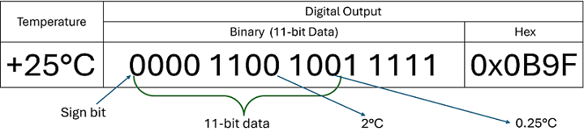
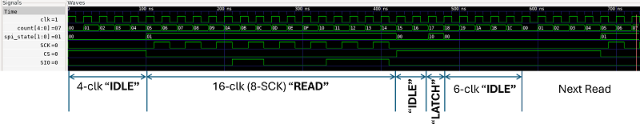

This is a repository which can be use a starting point to dsign and implement the [Digital Temperature Monitor](https://github.com/silicon-efabless/tt06-silicon-tinytapeout-lm07).

# Project Description

- **PRE-REQUISITES**
  - Install **Ubuntu 24.04** (22.04 is fine too) on **WSL2**. [See instructions here](https://github.com/silicon-vlsi-org/eda-wsl2)
  - Create a [GitHub](https://github.com) account if you don't have one already.
- Create a fork of this repo and clone it on your WSL Linux.
- Check [LM70 Datasheet](docs/datasheet-LM70-TI-tempSensor.pdf)
  - Check the basic electrical characteristics: Supply voltage range, temperature range, temperature resolution and accuracy, timing diagram (p-6), temperature data format (p-10).
  - **EXCERCISE** From the timing diagram specification (p:5-6), find the _maximum_ and _minimum_ clock frequency (SCK) the sensor can operate.

- The diagram above shows the data format from the temperature sensor.
  - `11-bit data` with 2s complement signed format.
  - LSB is `0.25 C`
- In this project we will only read the 8-bit MSB. That will give us an LSB of `2-deg C`
- **EXCERCISE**: When you read `0001 0100` What is the temperature in C ?

**DESIGN EXCERCISE**

- Run the template code which has the DUT module and the model of the LM07 connected.
- Start the blocks:
  - Design a **5-b counter**. Use **DEFINES** for the value for reset (eg. **RST_COUNT**) and maximum count (eg. **MAX_COUNT**)
  - Design **3-state (IDLE, READ, LATCH)**  such that:
    - At _reset_ OR (NOT READ amd NOT LATCH): **IDLE** state
    - During read: **READ** state
    - During latch: **LATCH** state
    - After system reset or counter reset, remain in IDLE state for `CS_LOW_COUNT` clock cycles.
    - Remain in READ state from `CS_LOW_COUNT` till `CS_HIGH_COUNT`
    - Then switch to IDLE state and after `SPI_LATCH_COUNT` switch to LATCH state for 1 clock cycle and then back to IDLE state.
  - Now let's implement the state machine for the following conditions:
    - The SPI clock `SCK` is system clock divide by 2
    - Let one complete read cycle (ie. IDLE-READ-IDLE-LATCH-IDLE) be 28  system clock cycles.
    - After reset, IDLE state for 4 system clock cycles
    - READ state for 16 system clock cycles (8 SCK cyceles)
    - LATCH state after 22 system clock cycles 
    - See the image below with the timing diagram of the implemented FSM with above parameters.

